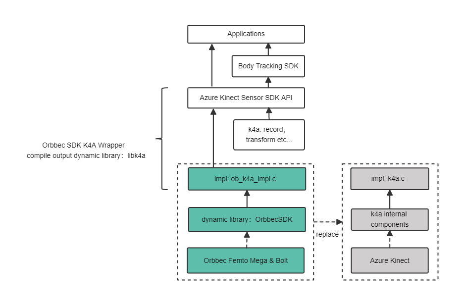

# Orbbec SDK K4A Wrapper

Welcome to the Orbbec SDK K4A Wrapper!

*This [repo](https://github.com/orbbec/OrbbecSDK-K4A-Wrapper) is forked from [Azure Kinect Sensor SDK](https://github.com/microsoft/Azure-Kinect-Sensor-SDK)*

*This branch is base on release/1.4.x, and use new impl code base on [Orbbec SDK](https://github.com/orbbec/OrbbecSDK) to replace the k4a implementation.*

*The usage of this library is same as [Native K4A](./README_K4A.md)*

## Introduction

This repository contains the K4A wrapper for Orbbec SDK, allowing users to develop applications using the K4A API and access Orbbec cameras. Additionally, users can replace the native K4A library in their application with this library without any code changes.


**What we did?**

The [k4a.h](./include/k4a/k4a.h) is the header file of K4A API, and the source code in [k4a.c](./src/sdk/k4a.c) is the implementation of K4A API. We have reimplemented the K4A API in [ob_k4a_impl.c](./src/orbbec/ob_k4a_impl.c) with Orbbec SDK, and keep the same effect as the original K4A API. Therefore, all functions called on user's side will be redirected to the Orbbec SDK, and user can access the Orbbec camera like the K4A device.




## Why use the Orbbec SDK K4A Wrapper

The Wrapper enables you to get the most out of your orbbec camera. Features include:

* Depth camera access
* RGB camera access and control (e.g. exposure and white balance)
* Motion sensor (gyroscope and accelerometer) access
* Synchronized Depth-RGB camera streaming with configurable delay between cameras
* External device synchronization control with configurable delay offset between devices
* Camera frame meta-data access for image resolution, timestamp and temperature
* Device calibration data access


## Installation

The following document describes how to seamlessly replace the Azure Kinect camera with the Femto camera in a user's application without any modifications. Please carefully read the following document before using the Femto Bolt camera.

[Access_AKDK_Application_Software_with_Femto_Bolt.pdf](https://orbbec.github.io/OrbbecSDK-K4A-Wrapper/src/orbbec/docs/Access_AKDK_Application_Software_with_Femto_Bolt.pdf)

### Option1：Install from Release SDK package
If you prefer not to compile the K4A Wrapper yourself, we recommend using our released SDK package. These released SDK packages have been tested and we highly recommend using them.

[Releases](https://github.com/orbbec/OrbbecSDK-K4A-Wrapper/releases/)


### Option2: Install from source code

#### Get source code

```bash
git clone https://github.com/orbbec/OrbbecSDK-K4A-Wrapper.git
git submodule update --init --recursive
```

#### Branch Introduction
* **main branch**: The main branch is the default and primary branch,The code in this branch is stable and has been tested.

* **develop branch**: The "develop" branch is the development branch that includes new features, but it is not stable.

* **others branch**: The other branches are new feature branches that have not been merged into "develop" yet.

#### Building


**It is identical to Native K4A, please refer to: [Building and Dependencies](docs/building.md)**


##### Windows:

* Ninja:

    ```powershell
    cd OrbbecSDK-K4A-Wrapper
    mkdir build
    cd build
    cmake .. -G Ninja
    ninja
    ninja install
    ```

* cmake:

    ```powershell
    cd OrbbecSDK-K4A-Wrapper
    mkdir build
    cd build
    cmake ../
    cmake --build .
    cmake --install .
    ```

##### Linux

* install dependencs:

    ```bash
    sudo apt update
    sudo apt install -y \
        pkg-config \
        ninja-build \
        doxygen \
        clang \
        gcc-multilib \
        g++-multilib \
        python3 \
        nasm

    sudo apt install -y \
        libgl1-mesa-dev \
        libsoundio-dev \
        libvulkan-dev \
        libx11-dev \
        libxcursor-dev \
        libxinerama-dev \
        libxrandr-dev \
        libusb-1.0-0-dev \
        libssl-dev \
        libudev-dev \
        mesa-common-dev \
        uuid-dev
    ```

*  building:
    * ninja:

        ```bash
        cd OrbbecSDK-K4A-Wrapper
        mkdir build && cd build
        sudo cmake .. -G Ninja
        sudo ninja
        sudo ninja install
        ```

    * cmake

        ```bash
        cd OrbbecSDK-K4A-Wrapper
        mkdir build && cd build
        sudo cmake ..
        sudo make -j8
        sudo make install
        ```

## Documentation

* API documentation: [https://orbbec.github.io/docs/OrbbecSDK_K4A_Wrapper](https://orbbec.github.io/docs/OrbbecSDK_K4A_Wrapper).
* Github pages: [https://orbbec.github.io/OrbbecSDK-K4A-Wrapper/](https://orbbec.github.io/OrbbecSDK-K4A-Wrapper/).
* How to seamlessly replace the Azure Kinect camera with the Femto camera: [Access_AKDK_Application_Software_with_Femto_Bolt.pdf](https://orbbec.github.io/OrbbecSDK-K4A-Wrapper/src/orbbec/docs/Access_AKDK_Application_Software_with_Femto_Bolt.pdf)

## Versioning

| **products list** | **firmware version** |**platform**|
| --- | --- | --- |
| Orbbec Femto Bolt  | 1.0.6/1.0.9  |Windows10+, Ubuntu18.04+ |
| Orbbec Femto Mega  | 1.1.5/1.1.7  |Windows10+, Ubuntu20.04+ |


## Testing

For information on writing or running tests, please see [testing.md](docs/testing.md)

## Feedback

For Orbbec SDK K4A Wrapper feedback or to report a bug, please file a [GitHub Issue](https://github.com/orbbec/OrbbecSDK-K4A-Wrapper/issues). For general suggestions or ideas, visit our [feedback forum](https://3dclub.orbbec3d.com/).

## Sample Code

As the Orbbec SDK K4A Wrapper directly uses the Azure Kinect Sensor SDK API, user can directly refer to the relevant examples of the Azure Kinect Sensor SDK：

* In this repository: [examples](https://github.com/orbbec/OrbbecSDK-K4A-Wrapper/tree/main/examples)- each example has a readme page that describes it and the steps to set it up.

* [Azure-Kinect-Samples](https://github.com/orbbec/Azure-Kinect-Samples) repository. There are multiple examples of how to use both Sensor and Body tracking SDKs.

## Q&A

1. The library of this branch is not support the K4A device, please use the [Native K4A](https://github.com/microsoft/Azure-Kinect-Sensor-SDK) library to access the K4A device.

2. The Orbbec SDK K4A Wrapper is aim to provide the same API as the K4A, but it's not full API for Orbbec SDK and feature for Orbbec camera. If you want to use the full feature of Orbbec camera, please use the [Orbbec SDK](https://github.com/orbbec/OrbbecSDK) directly.

3. For Linux user, there may be an issue with the initialization of DepthEngine when using Orbbec Femto Bolt due to modifications made by Microsoft in the new version of DepthEngine. This can cause failure during the start of the depth stream. The reason for this is that simultaneous use of multiple OpenGL contexts may result in conflicts. User can try to resolve it follow this: [https://www.khronos.org/opengl/wiki/OpenGL_and_multithreading](https://www.khronos.org/opengl/wiki/OpenGL_and_multithreading)

   For example：

    ``` c++
    // file: tools/k4aviewer/k4adevicedockcontrol.cpp
    GLFWwindow *currentContext = glfwGetCurrentContext(); // store the current context
    glfwMakeContextCurrent(NULL);  // make current context to NULL

    StartCameras(); //  will initialize the DepthEngine

    glfwMakeContextCurrent(currentContext); // restore the current context
    ```

4. Unable to obtain the device timestamp on the Windows platform
``` powershell
# Running as Administrator using PowerShell
cd src/orbbec/OrbbecSDK/misc/scripts
Set-ExecutionPolicy -ExecutionPolicy RemoteSigned -Scope CurrentUser
.\obsensor_metadata_win10.ps1 -op install_all
```

5. How to execute an application on the Linux platform without using sudo.
Install udev rules file：

 ``` bash
 cd src/orbbec/OrbbecSDK/misc/scripts
 sudo chmod +x ./install_udev_rules.sh
 ./install_udev_rules.sh
 # Once complete, the orbbec camera is available without being 'root'.
 ```

## Join Our Developer Program

Complete your developer profile [here](https://3dclub.orbbec3d.com/) to get connected with our Mixed Reality Developer Program.

## Reporting Security Issues

Security issues and bugs should be reported privately, via email, to the administrators at <[it@orbbec.com](mailto:it@orbbec.com)>.

## License Support for Orbbec SDK K4A Wrapper

[MIT License](LICENSE)
