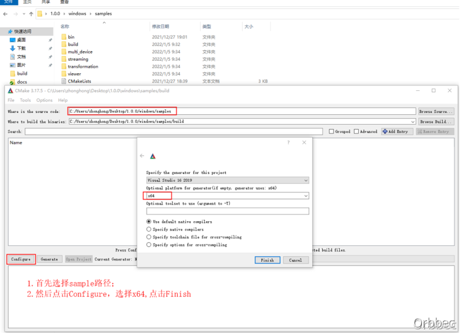
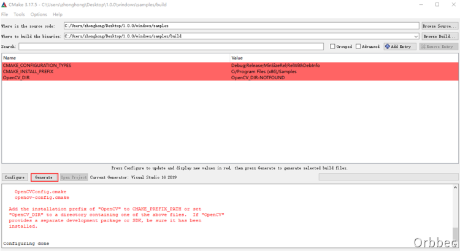
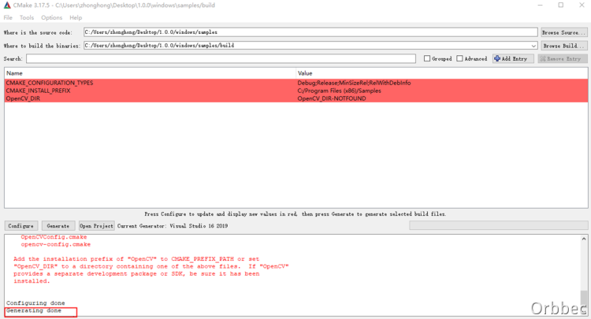
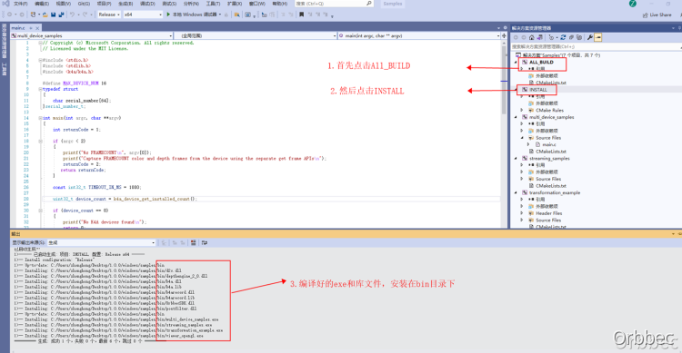
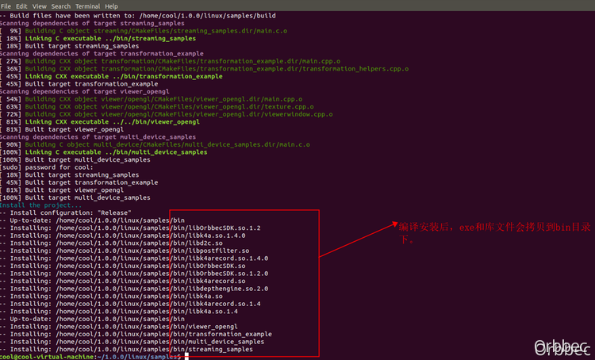
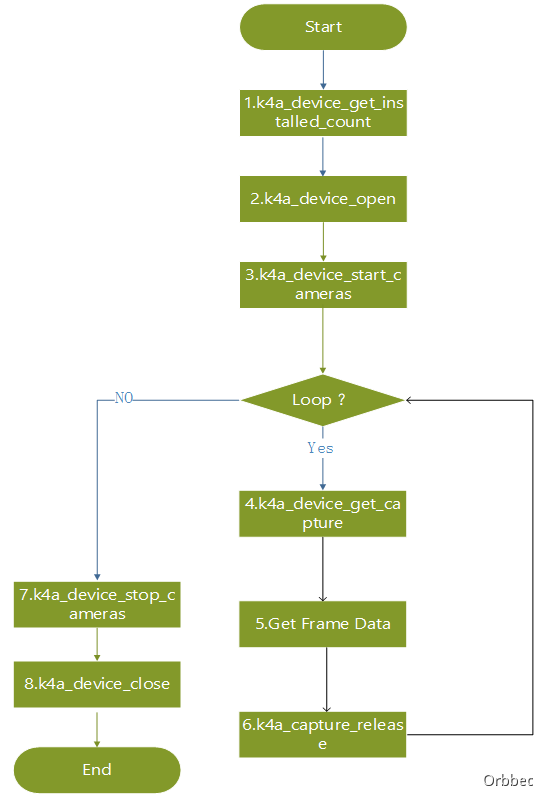
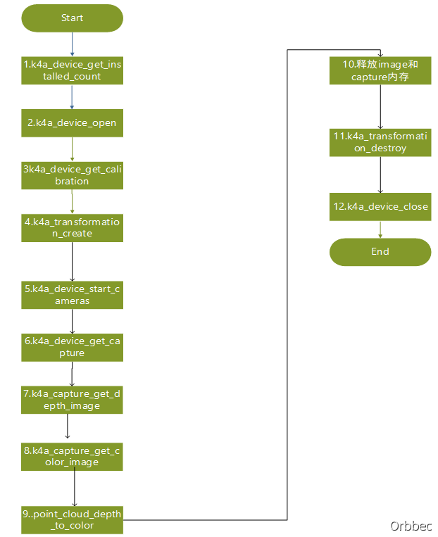

# 1. 简述
本文档主要介绍Orbbec SDK Kinect Wrapper的功能，Orbbec SDK Kinect Wrapper基于Orbbec SDK进行设计封装，将Orbbec SDK转换到Azure Kinect 传感器 SDK的接口。主要实现数据流接收，彩色参数设置，D2C和点云功能，录像和回放，API的接口和azure kinect 保持一致，方便用户无缝替换。<br />为了使用户正确的、高效的在自己的项目中快速接入Orbbec SDK Kinect，防止在使用相关API的过程中由于不规范的调用而引起其他问题，故拟定本文档来规范API调用。
# 2. Orbbec SDK Kinect Wrapper Sample编译说明
## 2.1 Windows 编译
1）打开Cmake，首先选择sample源码路径，将“samples”文件夹设置为代码路径，“samples”下的“build”文件夹设置为生成二进制文件的路径。如samples下无build，需要新建该文件夹。点击“Configure”并选择对应的Visual Studio版本和平台版本（vs2019，x64）后，如下图所示：<br /><br />2）点击“Finish”后，如下所示：<br /><br />3）点击“Generate”，如下所示：<br /><br />4）进入build目录下，使用管理员权限vs2019打开Samples。<br /><br />5) 首先点击编译，然后点击INSTALL。<br />

## 2.2 Linux 编译
1）在ubuntu20.04下，首先执行SDK linux目录下setup-ubuntu.sh 安装需要的依赖，再cd到sample目录，如下图所示：<br /><br />2）接着先chmod + x sample_build.sh，然后运行脚本：sample_build.sh，进行编译安装，界面如下：<br /><br />Linux根据系统情况，可能需要安装的依赖如下：<br />1. libsoundio-dev<br />sudo apt install libsoundio-dev<br />​

2. Libusb<br />sudo apt install libusb-1.0-0-dev<br />sudo apt install libudev-dev
# 3. 常用调用流程
## 3.1 视频数据获取
参考Sample [streaming]<br /><br />**图1：C接口获取视频数据流程图**<br />
<br />C++ 的Sample请参考： viewer_opengl

## 3.2 D2C 和点云
参考Sample transformation，流程图如下：<br /><br />**图2：D2C 和点云转换流程图**
# 4. API接口介绍
Wrapper中已经实现的API 接口如下，实现的接口和微软的Azure Kinect 传感器 SDK的接口保持一致。
## 4.1 C接口API
### 4.1.1 k4a_device_get_installed_count 函数
**功能描述**<br />函数功能：获取连接的设备数；<br />返回值：表示已经连接的设备个数。<br />**调用API**
```c
uint32_t k4a_device_get_installed_count(void)
```


### 4.1.2 k4a_set_debug_message_handler 函数
**功能描述**<br />函数功能：设置Log回调函数，应用程序调用这个接口，可以获取Wrapper的Log信息。<br />参数[入参]：message_cb：接收Log的回调函数；<br />参数[入参]：message_cb_context：回调函数带的参数；<br />参数[入参]：min_level：Log等级。<br />返回值：成功返回：K4A_RESULT_SUCCEEDED，失败返回：K4A_RESULT_FAILED。<br />**调用API**
```c
k4a_result_t k4a_set_debug_message_handler(k4a_logging_message_cb_t *message_cb,
                                                      void *message_cb_context,
                                                      k4a_log_level_t min_level);
```


### 4.1.3 k4a_device_open 函数
**功能描述**<br />函数功能：open设备，获取设备句柄。<br />参数[入参]：index：设备索引，表示第几个设备。<br />参数[出参]：device_handle：返回的设备句柄。<br />返回值：成功返回：K4A_RESULT_SUCCEEDED，失败返回：K4A_RESULT_FAILED。<br />**调用API**
```c
k4a_result_t k4a_device_open(uint32_t index, k4a_device_t *device_handle)
```


### 4.1.4 k4a_device_close函数
**功能描述**<br />函数功能：close设备。<br />参数[入参]：device_handle：为open设备获取的设备句柄。<br />返回值：无。<br />**调用API**
```c
void k4a_device_close(k4a_device_t device_handle)
```


### 4.1.5 k4a_device_start_cameras 函数
**功能描述**<br />函数功能：开流。<br />参数[入参]：device_handle：为open设备获取的设备句柄。<br />参数[入参]：config：开流的配置。<br />返回值：成功返回：K4A_RESULT_SUCCEEDED，失败返回：K4A_RESULT_FAILED。<br />​

注意事项：<br />1. 配置k4a_depth_mode_t 只支持K4A_DEPTH_MODE_640x480。<br />2. k4a_color_resolution_t：只支持K4A_COLOR_RESOLUTION_480P、K4A_COLOR_RESOLUTION_720P、K4A_COLOR_RESOLUTION_1080P。<br />**调用API**
```c
k4a_result_t k4a_device_start_cameras(k4a_device_t device_handle, const k4a_device_configuration_t *config);
```


### 4.1.6 k4a_device_stop_cameras 函数
**功能描述**<br />函数功能：停流函数。<br />参数[入参]：device_handle：为open设备获取的设备句柄。<br />返回值：无<br />**调用API**
```c
void k4a_device_stop_cameras(k4a_device_t device_handle);
```


### 4.1.7 k4a_device_get_capture 函数
**功能描述**<br />函数功能：获取k4a_capture_t，通过capture_handle，在获取视频帧。<br />参数[入参]：device_handle：为open设备获取的设备句柄。<br />参数[出参]：capture_handle： 返回的capture句柄。<br />参数[入参]：timeout_in_ms：超时时间。<br />返回值：成功返回：K4A_WAIT_RESULT_SUCCEEDED；失败返回：K4A_WAIT_RESULT_FAILED；超时返回：K4A_WAIT_RESULT_TIMEOUT。<br />**调用API**
```c
k4a_wait_result_t k4a_device_get_capture(k4a_device_t device_handle,
                                         k4a_capture_t *capture_handle,
                                         int32_t timeout_in_ms)
```

### 4.1.8 k4a_capture_create函数
**功能描述**<br />函数功能：创建一个空的capture对象。<br />参数[出参]：capture_handle： 创建的capture对象。<br />返回值：成功返回：K4A_RESULT_SUCCEEDED；失败返回：K4A_RESULT_FAILED<br />**调用API**
```c
k4a_result_t k4a_capture_create(k4a_capture_t *capture_handle)
```

### 4.1.9 k4a_capture_release函数
**功能描述**<br />函数功能：释放capture内存。<br />参数[入参]：capture_handle： k4a_device_get_capture函数获取的句柄。<br />返回值：无<br />**调用API**
```c
void k4a_capture_release(k4a_capture_t capture_handle)
```


### 4.1.9 k4a_capture_reference 函数
**功能描述**<br />函数功能：增加capture句柄引用计数<br />参数[入参]：capture_handle： k4a_device_get_capture函数获取的句柄。<br />返回值：无。<br />**调用API**
```c
void k4a_capture_reference(k4a_capture_t capture_handle)
```


### 4.1.10 k4a_capture_get_color_image 函数
**功能描述**<br />函数功能：获取color帧句柄，然后通过k4a_image_t句柄获取帧数据。<br />参数[入参]：capture_handle： k4a_device_get_capture函数获取的句柄。<br />返回值：color 帧句柄。<br />**调用API**
```c
k4a_image_t k4a_capture_get_color_image(k4a_capture_t capture_handle)
```


### 4.1.11 k4a_capture_get_depth_image函数
**功能描述**<br />函数功能：获取depth帧句柄，然后通过k4a_image_t句柄获取帧数据。<br />参数[入参]：capture_handle： k4a_device_get_capture函数获取的句柄。<br />返回值：depth帧句柄。<br />**调用API**
```c
k4a_image_t k4a_capture_get_depth_image(k4a_capture_t capture_handle)
```


### 4.1.12 k4a_capture_get_ir_image函数
**功能描述**<br />函数功能：获取IR帧句柄，然后通过k4a_image_t句柄获取帧数据。<br />参数[入参]：capture_handle： k4a_device_get_capture函数获取的句柄。<br />返回值：IR帧句柄。<br />**调用API**
```c
k4a_image_t k4a_capture_get_ir_image(k4a_capture_t capture_handle)
```


### 4.1.13 k4a_image_create函数
**功能描述**<br />函数功能：通过外部参数，创建image_handle,主要作用分配image_handle的相关内存，可以用在外部格式转换等，如MJPEG转BGRA时，申请BGRA的内存，k4aviewer这样调用。<br />​

参数[入参]：format：<br />只支持K4A_IMAGE_FORMAT_DEPTH16、K4A_IMAGE_FORMAT_IR16<br />、K4A_IMAGE_FORMAT_COLOR_BGRA32。<br />参数[入参]：width_pixels：图像的宽；<br />参数[入参]：height_pixels：图像的高；<br />参数[入参]：stride_bytes：图像一行的步长；<br />参数[出参]：image_handle： 返回的k4a_image_t句柄。<br />​

返回值：成功返回：K4A_RESULT_SUCCEEDED，失败返回：K4A_RESULT_FAILED。<br />**调用API**
```c
k4a_result_t k4a_image_create(k4a_image_format_t format,
                              int width_pixels,
                              int height_pixels,
                              int stride_bytes,
                              k4a_image_t *image_handle)
```


### 4.1.14 k4a_image_get_buffer函数
**功能描述**<br />函数功能：通过k4a_image_t句柄获取帧数据。<br />参数[入参]：image_handle： 图像句柄。<br />返回值：获取帧数据Buffer。<br />**调用API**
```c
uint8_t *k4a_image_get_buffer(k4a_image_t image_handle)
```


### 4.1.15 k4a_image_get_size函数
**功能描述**<br />函数功能：通过k4a_image_t句柄获取帧数据的大小。<br />参数[入参]：image_handle： 图像句柄。<br />返回值：获取帧内存的Size。<br />**调用API**
```c
size_t k4a_image_get_size(k4a_image_t image_handle)
```


### 4.1.16 k4a_image_get_format函数
**功能描述**<br />函数功能：通过k4a_image_t句柄获取帧格式。<br />参数[入参]：image_handle： 图像句柄。<br />返回值：获取帧格式。<br />**调用API**
```c
k4a_image_format_t k4a_image_get_format(k4a_image_t image_handle)
```


### 4.1.17 k4a_image_get_width_pixels函数
**功能描述**<br />函数功能：通过k4a_image_t句柄获取帧的Width。<br />参数[入参]：image_handle： 图像句柄。<br />返回值：获取帧的Width。<br />**调用API**
```c
int k4a_image_get_width_pixels(k4a_image_t image_handle)
```


### 4.1.18 k4a_image_get_height_pixels函数
**功能描述**<br />函数功能：通过k4a_image_t句柄获取帧的Height。<br />参数[入参]：image_handle： 图像句柄。<br />返回值：获取帧的Height。<br />**调用API**
```c
int k4a_image_get_height_pixels(k4a_image_t image_handle)
```


### 4.1.19 k4a_image_get_stride_bytes函数
**功能描述**<br />函数功能：通过k4a_image_t句柄获取帧步长。<br />参数[入参]：image_handle： 图像句柄。<br />返回值：获取帧的步长，一行数据的大小。<br />**调用API**
```c
int k4a_image_get_stride_bytes(k4a_image_t image_handle)
```


### 4.1.20 k4a_image_get_device_timestamp_usec函数
**功能描述**<br />函数功能：通过k4a_image_t句柄获取帧的设备时间戳。<br />参数[入参]：image_handle： 图像句柄。<br />返回值：获取帧的设备时间戳。<br />**调用API**
```c
uint64_t k4a_image_get_device_timestamp_usec(k4a_image_t image_handle)
```
**​**<br />
### 4.1.21 k4a_image_get_system_timestamp_nsec函数
**功能描述**<br />函数功能：通过k4a_image_t句柄获取帧的系统时间戳。<br />参数[入参]：image_handle： 图像句柄。<br />返回值：获取帧的系统时间戳。<br />**调用API**
```c
uint64_t k4a_image_get_system_timestamp_nsec(k4a_image_t image_handle)
```


### 4.1.22 k4a_image_reference函数
**功能描述**<br />函数功能：帧引用计数。<br />参数[入参]：image_handle： 图像句柄。<br />返回值：无。<br />**调用API**
```c
void k4a_image_reference(k4a_image_t image_handle)
```


### 4.1.23 k4a_image_release函数
**功能描述**<br />函数功能：释放帧内存。<br />参数[入参]：image_handle： 图像句柄。<br />返回值：无。<br />**调用API**
```c
void k4a_image_release(k4a_image_t image_handle)
```


### 4.1.24 k4a_device_get_serialnum函数
**功能描述**<br />函数功能：获取设备序列号。<br />参数[入参]：device_handle： 设备句柄。<br />参数[出参]：serial_number： 设备序列号。<br />参数[出参]：serial_number_size： 设备序列号的长度。<br />返回值：成功：K4A_BUFFER_RESULT_SUCCEEDED； 失败：K4A_BUFFER_RESULT_FAILED。<br />**调用API**
```c
k4a_buffer_result_t k4a_device_get_serialnum(k4a_device_t device_handle,
                                             char *serial_number,
                                             size_t *serial_number_size)
```


### 4.1.25 k4a_device_get_version函数
**功能描述**<br />函数功能：获取固件版本信息。<br />参数[入参]：device_handle： 设备句柄。<br />参数[出参]：version： 版本信息。<br />返回值：成功返回：K4A_RESULT_SUCCEEDED，失败返回：K4A_RESULT_FAILED。<br />​

注意事项：<br />版本信息中只有depth的版本信息有效[k4a_version_t depth]，其它版本信息填的是空的，无效。<br />**调用API**
```c
k4a_result_t k4a_device_get_version(k4a_device_t device_handle, k4a_hardware_version_t *version)
```


### 4.1.26 k4a_device_get_color_control函数
**功能描述**<br />函数功能：获取color的参数。<br />参数[入参]：device_handle： 设备句柄。<br />参数[入参]：command： 命令码。<br />参数：mode：参数该接口没有用到，为了保持和原来的kinect接口一致，参数保留。<br />参数[出参]: value:  获取command对应的参数值。<br />返回值：成功返回：K4A_RESULT_SUCCEEDED，失败返回：K4A_RESULT_FAILED。<br />**调用API**
```c
k4a_result_t k4a_device_get_color_control(k4a_device_t device_handle,
                                          k4a_color_control_command_t command,
                                          k4a_color_control_mode_t *mode,
                                          int32_t *value)
```


### 4.1.27 k4a_device_set_color_control函数
**功能描述**<br />函数功能：设置color的参数。<br />参数[入参]：device_handle： 设备句柄。<br />参数[入参]：command： 命令码。<br />参数[入参]：mode：手动或自动模式<br />参数[出参]: value:  设置command对应的参数值。<br />返回值：成功返回：K4A_RESULT_SUCCEEDED，失败返回：K4A_RESULT_FAILED。<br />​

注意事项：<br />mode: <br />自动和手动 只对K4A_COLOR_CONTROL_EXPOSURE_TIME_ABSOLUTE 和 K4A_COLOR_CONTROL_WHITEBALANCE 有效。<br />**调用API**
```c
k4a_result_t k4a_device_set_color_control(k4a_device_t device_handle,
                                          k4a_color_control_command_t command,
                                          k4a_color_control_mode_t mode,
                                          int32_t value)
```


### 4.1.28 k4a_device_get_calibration函数
**功能描述**<br />函数功能：设置标定的内外参。<br />参数[入参]：device_handle： 设备句柄。<br />参数[入参]：depth_mode： 只支持K4A_DEPTH_MODE_640x480。<br />参数[入参]：color_resolution：RGB分辨率，支持1080P,720P和640x480。<br />参数[出参]:calibration :  获取标定的内外参。<br />返回值：成功返回：K4A_RESULT_SUCCEEDED，失败返回：K4A_RESULT_FAILED。<br />**调用API**
```c
k4a_result_t k4a_device_get_calibration(k4a_device_t device_handle,
                                        const k4a_depth_mode_t depth_mode,
                                        const k4a_color_resolution_t color_resolution,
                                        k4a_calibration_t *calibration)
```


### 4.1.29 k4a_transformation_create函数
**功能描述**<br />函数功能：通过标定参数获取 k4a_transformation_t 句柄。<br />参数[入参]：calibration： 标定的内外参<br />返回值：返回 k4a_transformation_t 句柄。主要用来做D2C或点云。<br />**调用API**
```c
k4a_transformation_t k4a_transformation_create(const k4a_calibration_t *calibration)
```


### 4.1.30 k4a_transformation_destroy函数
**功能描述**<br />函数功能：释放k4a_transformation_t 句柄关联的内存<br />参数[入参]：transformation_handle： 通过k4a_transformation_create生成的句柄。<br />返回值：无。<br />**调用API**
```c
void k4a_transformation_destroy(k4a_transformation_t transformation_handle)
```


### 4.1.31 k4a_transformation_depth_image_to_color_camera函数
**功能描述**<br />函数功能：将depth图像 对齐color图像坐标系。<br />参数[入参]：transformation_handle： 通过k4a_transformation_create生成的句柄。<br />参数[入参]：depth_image： depth图像句柄。<br />参数[出参]：transformed_depth_image：转换到color坐标系的Depth图像。<br />返回值：成功返回：K4A_RESULT_SUCCEEDED，失败返回：K4A_RESULT_FAILED。<br />**调用API**
```c
k4a_result_t k4a_transformation_depth_image_to_color_camera(k4a_transformation_t transformation_handle,const k4a_image_t depth_image,k4a_image_t transformed_depth_image)
```


### 4.1.32 k4a_transformation_depth_image_to_color_camera函数
**功能描述**<br />函数功能：通过标定的内外参，将depth图像转成点云。<br />参数[入参]：transformation_handle： 通过k4a_transformation_create生成的句柄。<br />参数[入参]：depth_image： depth图像句柄。<br />参数[入参]：camera：K4A_CALIBRATION_TYPE_COLOR或K4A_CALIBRATION_TYPE_DEPTH<br />参数[出参]：xyz_image：转换后的点云。<br />返回值：成功返回：K4A_RESULT_SUCCEEDED，失败返回：K4A_RESULT_FAILED。<br />**调用API**
```c
k4a_result_t k4a_transformation_depth_image_to_point_cloud(k4a_transformation_t transformation_handle,const k4a_image_t depth_image,const k4a_calibration_type_t camera,
k4a_image_t xyz_image)
```


## 4.2 C++ 接口API
C++的API是对C接口API的封装，k4a.hpp中对k4a.h的API进行封装。<br />C++的API 分成4个部分。<br />1. device类的API。<br />2. capture类的API。<br />3. image类API。<br />4. transformation类API。
### 4.2.1 get_installed_count函数
**功能描述**<br />函数功能：获取连接的设备数；<br />返回值：表示已经连接的设备个数。<br />**调用API**
```c
static uint32_t get_installed_count() noexcept
```


### 4.2.2 open函数
**功能描述**<br />函数功能：open设备，获取设备句柄。<br />参数[入参]：index：设备索引，表示第几个设备。<br />返回值：返回打开设备的对象。<br />**调用API**
```c
static device open(uint32_t index)
```


### 4.2.3 close函数
**功能描述**<br />函数功能：close设备。<br />返回值：无。<br />**调用API**
```c
void close() noexcept
```
**​**<br />
### 4.2.4 get_serialnum函数
**功能描述**<br />函数功能：获取设备序列号。<br />返回值：设备序列号字符串。<br />**调用API**
```c
std::string get_serialnum() const
```
**​**<br />
### 4.2.5 start_cameras函数
**功能描述**<br />函数功能：开流。<br />参数[入参]：configuration：开流的配置<br />返回值：无<br />**调用API**
```c
void start_cameras(const k4a_device_configuration_t *configuration)
```
**​**<br />
### 4.2.6 stop_cameras函数
**功能描述**<br />函数功能：停流。<br />参数[入参]：无<br />返回值：无<br />**调用API**
```c
void stop_cameras() noexcept
```
**​**<br />
### 4.2.7 get_capture函数
**功能描述**<br />函数功能：获取capture对象。<br />参数[出参]：cap：返回的capture对象。<br />参数[入参]：timeout：超时时间，单位毫秒。<br />返回值：成功返回true，失败返回false。<br />**调用API**
```c
bool get_capture(capture *cap, std::chrono::milliseconds timeout)
```
**​**<br />
### 4.2.8 get_color_control函数
**功能描述**<br />函数功能：获取color参数。<br />参数[入参]：command:命令码<br />参数：mode：无效参数，由于接口兼容kinect，保留。<br />参数[出参]：获取的color参数值。<br />返回值：无<br />**调用API**
```c
void get_color_control(k4a_color_control_command_t command, k4a_color_control_mode_t *mode, int32_t *value) 
```
**​**<br />
### 4.2.9 set_color_control函数
**功能描述**<br />函数功能：设置color参数。<br />参数[入参]：command:命令码<br />参数[入参]：mode：手动或自动模式，请参考C的接口。<br />参数[入参]：设置的color参数值。<br />返回值：无<br />**调用API**
```c
void set_color_control(k4a_color_control_command_t command, k4a_color_control_mode_t mode, int32_t value)
```
**​**<br />
### 4.2.10 set_color_control函数
**功能描述**<br />函数功能：设置color参数。<br />参数[入参]：command:命令码<br />参数[入参]：mode：手动或自动模式，请参考C的接口。<br />参数[入参]：设置的color参数值。<br />返回值：无<br />**调用API**
```c
void set_color_control(k4a_color_control_command_t command, k4a_color_control_mode_t mode, int32_t value)
```
**​**<br />
### 4.2.11 get_calibration函数
**功能描述**<br />函数功能：获取标定的内外参。<br />参数[入参]：depth_mode： 只支持K4A_DEPTH_MODE_640x480。<br />参数[入参]：color_resolution：RGB分辨率，支持1080P, 720P和640x480。<br />返回值：返回标定的内外参数据。<br />**调用API**
```c
calibration get_calibration(k4a_depth_mode_t depth_mode, k4a_color_resolution_t color_resolution) 
```
**​**<br />
### 4.2.12 get_color_image函数
**功能描述**<br />函数功能：获取color帧对象。<br />返回值：返回image对象。<br />**调用API**
```c
image get_color_image() const noexcept
```
**​**<br />
### 4.2.13 get_depth_image函数
**功能描述**<br />函数功能：获取depth帧对象。<br />返回值：返回image对象。<br />**调用API**
```c
image get_depth_image() const noexcept
```
**​**<br />
### 4.2.14 get_ir_image函数
**功能描述**<br />函数功能：获取ir帧对象。<br />返回值：返回image对象。<br />**调用API**
```c
image get_ir_image() const noexcept
```
**​**<br />
### 4.2.15 get_buffer函数
**功能描述**<br />函数功能：获取帧数据。<br />返回值：返回帧数据。<br />**调用API**
```c
uint8_t *get_buffer() noexcept
```
**​**<br />
### 4.2.16 get_size函数
**功能描述**<br />函数功能：获取帧的大小。<br />返回值：返回帧数据大小。<br />**调用API**
```c
size_t get_size() const noexcept
```
**​**<br />
### 4.2.17 get_format函数
**功能描述**<br />函数功能：获取帧的格式。<br />返回值：返回帧的格式。<br />**调用API**
```c
k4a_image_format_t get_format() const noexcept
```
**​**<br />
### 4.2.18 get_width_pixels函数
**功能描述**<br />函数功能：获取帧的width。<br />返回值：返回帧的width。<br />**调用API**
```c
int get_width_pixels() const noexcept
```
**​**<br />
### 4.2.19 get_height_pixels函数
**功能描述**<br />函数功能：获取帧的height。<br />返回值：返回帧的height。<br />**调用API**
```c
int get_height_pixels() const noexcept
```
**​**<br />
### 4.2.20 get_stride_bytes函数
**功能描述**<br />函数功能：获取帧的步长，一行数据大小<br />返回值：返回帧的步长。<br />**调用API**
```c
int get_stride_bytes() const noexcept
```
**​**<br />
### 4.2.21 get_device_timestamp函数
**功能描述**<br />函数功能：获取设备时间戳<br />返回值：返回设备时间戳。<br />**调用API**
```c
 std::chrono::microseconds get_device_timestamp() const noexcept
```
**​**<br />
### 4.2.22 get_system_timestamp函数
**功能描述**<br />函数功能：获取系统时间戳。<br />返回值：返回系统时间戳。<br />**调用API**
```c
std::chrono::nanoseconds get_system_timestamp() const noexcept
```


### 4.2.23 depth_image_to_color_camera函数
**功能描述**<br />函数功能：通过调用C接口，得到一个k4a_transformation_t 句柄。<br />入参：calibration：标定的内外参。<br />**调用API**
```c
transformation(const k4a_calibration_t &calibration)
```
**​**<br />
### 4.2.24 destroy函数
**功能描述**<br />函数功能：通过调用C接口(k4a_transformation_destroy)释放内存。<br />**调用API**
```c
void destroy() noexcept
```


### 4.2.25 depth_image_to_color_camera函数
**功能描述**<br />函数功能：将depth图像 对齐color图像坐标系。<br />参数[入参]：depth_image：depth图像；<br />参数[出参]：transformed_depth_image：转换后的depth图像；<br />**调用API**
```c
void depth_image_to_color_camera(const image &depth_image, image *transformed_depth_image) const
```
**​**<br />
### 4.2.26 depth_image_to_color_camera函数
**功能描述**<br />函数功能：将depth图像转点云。<br />参数[入参]：depth_image： depth图像。<br />参数[入参]：camera：K4A_CALIBRATION_TYPE_COLOR或K4A_CALIBRATION_TYPE_DEPTH<br />参数[出参]：xyz_image：转换后的点云。<br />**调用API**
```c
void depth_image_to_point_cloud(const image &depth_image, k4a_calibration_type_t camera, image *xyz_image) const
```
